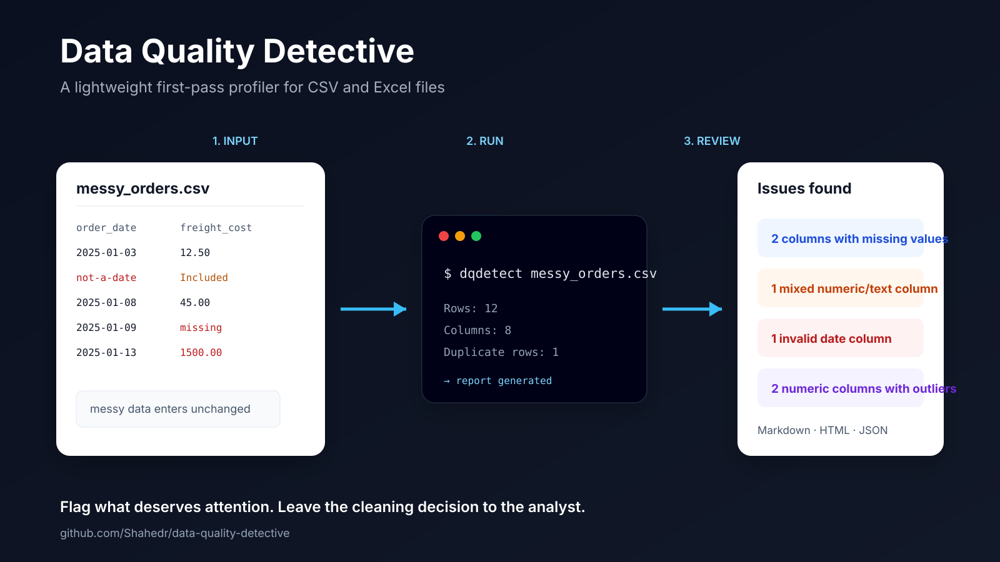

# Data Quality Detective

   

A small command-line tool for quickly profiling CSV and Excel files before analysis.

I built this around a problem I keep running into in analytics work: a dataset can look usable at first, but the real issues only show up after checking missing values, duplicate rows, mixed numeric/text fields, date parsing, and unusual numeric values.

**dqdetect** puts those checks into one repeatable command and writes a report you can review or share.

## Quick start

Install the latest public release from PyPI:

~~~bash
pip install dqdetect
~~~

Then profile a CSV or Excel file:

~~~bash
dqdetect path/to/file.csv
~~~

The current PyPI release, **v0.1.0**, writes Markdown and HTML reports to the **reports/** folder by default.

## What it checks

- dataset shape and column types
- duplicate rows
- missing values by column
- constant columns
- mixed numeric/text values
- invalid values in date-like columns
- IQR-based outlier counts for numeric columns

The tool does **not** automatically delete or "fix" anything. The report is meant to help an analyst decide what deserves review.

## Example

~~~text
Data Quality Detective
File: examples/messy_orders.csv

Rows: 12
Columns: 8
Duplicate rows: 1

Issues found
- 2 columns contain missing values
- 1 column contains mixed numeric/text values
- 1 date-like column contains invalid values
- 2 numeric columns contain potential IQR outliers

Reports written to:
  reports/messy_orders_report.md
  reports/messy_orders_report.html
~~~

See [examples/messy_orders_report.md](examples/messy_orders_report.md) for the readable sample report or [examples/messy_orders_report.json](examples/messy_orders_report.json) for the machine-readable version.

## CLI

Available in the current PyPI release:

~~~bash
dqdetect path/to/file.csv
dqdetect workbook.xlsx --sheet Orders
dqdetect workbook.xlsx --sheet 0
dqdetect data.csv --format html
dqdetect data.csv --output audit_reports
~~~

Supported input formats:

- CSV
- Excel (.xlsx)

## Development version

The `main` branch includes machine-readable JSON output that is planned for the next release:

~~~bash
dqdetect data.csv --format json
dqdetect data.csv --format all
~~~

JSON output includes the dataset summary, per-column profile, issue flags, and recommendations.

## Scope

**dqdetect is a first-pass profiler, not an automatic data cleaner or full validation framework.** It is meant for the point where you have just received a file and want a quick, repeatable view of what deserves attention before deeper analysis.

That is why the tool reports suspicious values without changing the source data.

## Why these checks?

This first version focuses on issues that can change an analysis if they are handled carelessly.

For example, a freight-cost field containing both dollar values and text such as "included elsewhere" should not simply be converted to zero. Likewise, an extreme numeric value may be a data-entry problem or a legitimate observation. The tool flags these cases instead of making the decision for you.

## Project structure

~~~text
data-quality-detective/
├── dqdetect/
│   ├── __init__.py
│   ├── checks.py
│   ├── cli.py
│   ├── io.py
│   ├── profiler.py
│   └── report.py
├── examples/
│   ├── messy_orders.csv
│   ├── messy_orders_report.md
│   └── messy_orders_report.json
├── tests/
├── .github/workflows/tests.yml
├── CONTRIBUTING.md
├── LICENSE
└── pyproject.toml
~~~

## Development

To work with the latest code from `main`:

~~~bash
git clone https://github.com/Shahedr/data-quality-detective.git
cd data-quality-detective
pip install -e ".[dev]"
pytest
~~~

## Roadmap

Things I would like to add next:

- user-configurable thresholds
- schema rules for expected columns and types
- PostgreSQL table profiling
- comparison between two versions of a dataset
- richer HTML charts
- optional GitHub Action for automated data-quality checks

I am keeping the first release intentionally small so the checks are understandable and easy to extend.

## License

MIT
